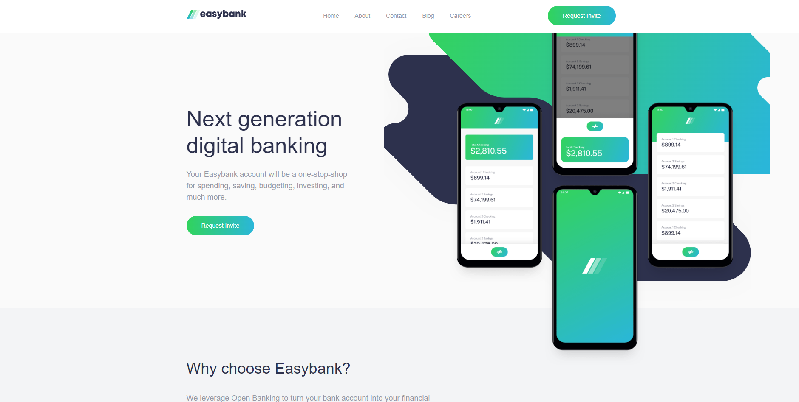

# Frontend Mentor - Easybank landing page solution

This is a solution to the [Easybank landing page challenge on Frontend Mentor](https://www.frontendmentor.io/challenges/easybank-landing-page-WaUhkoDN). Frontend Mentor challenges help you improve your coding skills by building realistic projects.

## Table of contents

-   [Overview](#overview)
    -   [The challenge](#the-challenge)
    -   [Screenshot](#screenshot)
    -   [Links](#links)
-   [My process](#my-process)
    -   [Built with](#built-with)
    -   [Continued development](#continued-development)
    -   [Useful resources](#useful-resources)
-   [Author](#author)
-   [Acknowledgments](#acknowledgments)

**Note: Delete this note and update the table of contents based on what sections you keep.**

## Overview

### The challenge

Users should be able to:

-   View the optimal layout for the site depending on their device's screen size
-   See hover states for all interactive elements on the page

### Screenshot

### Links

-   Live Site URL: [easybank-live-solution](https://easybank-frontendmentor-solution.netlify.app/)

## My process

### Built with

-   Semantic HTML5 markup
-   SCSS
-   Flexbox
-   CSS Grid
-   Mobile-first workflow
-   Vanilla Javascript

### Continued development

I will master JavaScript before moving on to ReactJS. Everyone talking about ReactJS and it makes me really curious.

**Note: Delete this note and the content within this section and replace with your own plans for continued development.**

### Useful resources

-   [Jessica Chan](https://www.youtube.com/watch?v=aoQ6S1a32j8&t=8687s) - This helped me a lot whenever I got stuck on building my own solution.

## Author

-   Website - [Dunca Robert](https://www.your-site.com)
-   Frontend Mentor - [@dnkratos](https://www.frontendmentor.io/profile/dnkratos)
-   LinkedIn - [@dnkratos](www.linkedin.com/in/dnkratos)

## Acknowledgments

I would like to thank Jessica Chan for her solution on the website which helped me building the website solution.
